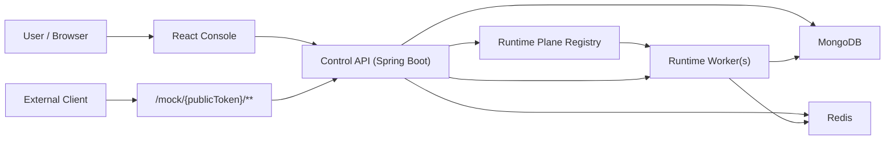

# MSaaS Console

**MSaaS Console** is a Mock Server as a Service platform for private OpenAPI projects, warm Java mock slots, public-by-link mock APIs, request diagnostics, and team access control.

GitHub description:

```text
Mock Server as a Service with private OpenAPI projects, Java warm runtime slots, hashed public tokens, optional mock API keys, request logs, audit, and a React console.
```

## What It Does

MSaaS helps frontend, QA, and integration teams work before a real backend is ready:

1. Register or log in.
2. Create a private project.
3. Upload an OpenAPI YAML or JSON contract.
4. Publish a `STATELESS` or `STATEFUL` mock instance.
5. Call the generated mock URL from an app, Postman, curl, or the built-in console.
6. Inspect logs, state snapshots, audit events, runtime slots, and worker health.

Published mock traffic uses:

```text
http://localhost:8081/mock/{publicToken}/...
```

The project and logs require JWT. The mock URL is public-by-link. If `requireApiKey` is enabled, calls must also include:

```text
X-Mock-Api-Key: <key-shown-once>
```

## Current Feature Set

- Java 25 + Spring Boot 4 backend.
- MongoDB persistence.
- JWT auth.
- Private projects with `OWNER`, `MEMBER`, and `VIEWER` roles.
- OpenAPI REST parsing, validation, route normalization, examples, and schema-generated responses.
- Java warm runtime slots rather than a container per mock.
- Runtime scale mode with separate control gateway and Java runtime workers.
- Redis-backed stateful mock state and distributed rate limits outside worker memory.
- Long public mock token stored as a hash in MongoDB.
- Public URL and mock API key are shown once after publish or rotation.
- Optional `X-Mock-Api-Key` per instance.
- Per-instance rate limits with `429` and `Retry-After`.
- Scenario overrides for published mock instances.
- Safe response templates such as `{{path.id}}`, `{{query.name}}`, `{{body.field}}`, `{{uuid}}`, and `{{now}}`.
- Deterministic schema-based smart JSON responses when an OpenAPI response has a schema but no explicit example.
- Per-instance response rules for fixed values, random integer ranges, enum choices, and template strings.
- Response preview for route/status/content-type/example/seed checks before calling a mock.
- Environment profiles per instance (`dev`, `qa`, `demo`, and custom profiles) with fast switching without changing the public mock URL.
- Fault profiles with configurable `4xx/5xx` percentage and min/max latency jitter.
- Request logs record the response source: scenario, response rule, OpenAPI example, schema generation, stateful CRUD, or fallback.
- Response status override with `__status` or `X-Mock-Status`.
- Named OpenAPI response example selection with `__example` or `X-Mock-Example`.
- `Accept`-aware response content negotiation when an OpenAPI response declares multiple content types.
- Debug mismatch hints with `__debug=true` or `X-Mock-Debug: true`.
- Delay override with `__delay` or `X-Mock-Delay-Ms`, capped at 10 seconds.
- Required query/header/body matching from OpenAPI operations.
- Stateful CRUD behavior and state snapshot endpoint.
- Request logs with redacted sensitive headers, query values, and JSON body fields.
- Audit log for project/spec/instance/member changes.
- Runtime worker registry and slot introspection endpoints.
- Unique usernames for day-to-day collaboration; email is used for registration and recovery-style identity.
- Admin console for platform summary, users, projects, instances, paginated logs, paginated audit, runtime health, rate-limit events, and unmatched ratio.
- Admin user management: promote/revoke admins, disable/enable users, and delete users with confirmation.
- Admin deletion for projects and mock instances with the same runtime/log cleanup as normal project flows.
- Bootstrap admin account by email through `ADMIN_BOOTSTRAP_EMAIL`.
- Swagger UI at `/swagger-ui.html`.
- Responsive React console with light/dark theme and RU/EN language switch.

## Architecture



Runtime can run embedded for local development or split into a control gateway plus one or more Java runtime workers. The public mock URL stays stable while the control service proxies `/mock/{publicToken}/**` to runtime workers over an internal endpoint.

## Tech Stack

Backend:

- Java 25 LTS
- Spring Boot 4
- Spring MVC
- Spring Security
- Spring Data MongoDB
- springdoc-openapi
- Swagger Parser
- Testcontainers profile for integration tests

Frontend:

- React 19
- TypeScript
- Vite
- lucide-react
- CSS variables for themes

Infrastructure:

- Docker Compose
- MongoDB 8
- Redis 7

## Repository Layout

```text
.
|-- docker-compose.yml
|-- README.md
|-- docs
|   |-- demo-openapi.yaml
|   `-- msaas-smoke.http
|-- server
|   |-- Dockerfile
|   |-- pom.xml
|   `-- src
|       |-- main/java/com/msaas
|       |   |-- admin
|       |   |-- audit
|       |   |-- auth
|       |   |-- common
|       |   |-- config
|       |   |-- instance
|       |   |-- log
|       |   |-- project
|       |   |-- runtime
|       |   |-- security
|       |   |-- spec
|       |   `-- user
|       `-- test/java/com/msaas
`-- ui
    |-- Dockerfile
    |-- package.json
    `-- src
```

## Run With Docker Compose

Start Docker Desktop first, then:

```powershell
cd D:\MSaaS
docker compose up -d --build
```

Use `.env.example` as the reference for local variables if you run services outside Compose or want to document deployment defaults.

Open:

- UI: http://localhost:5173
- Health: http://localhost:8081/actuator/health
- Swagger UI: http://localhost:8081/swagger-ui.html
- OpenAPI JSON: http://localhost:8081/v3/api-docs

The first account registered with the email from `ADMIN_BOOTSTRAP_EMAIL` becomes a system admin. Docker Compose uses:

```text
admin@example.com
```

Register that email in the UI to unlock the Admin section.

Useful commands:

```powershell
docker compose ps
docker compose logs -f server
docker compose logs -f runtime
docker compose logs -f ui
docker compose down
docker compose down -v
```

Scale runtime workers:

```powershell
docker compose up -d --build --scale runtime=3
```

Runtime roles are controlled by environment variables:

- `APP_RUNTIME_ROLE=EMBEDDED` keeps the original single-process mode.
- `APP_RUNTIME_ROLE=CONTROL` runs the control API and public mock gateway.
- `APP_RUNTIME_ROLE=RUNTIME` runs an internal Java mock worker.
- `APP_RUNTIME_INTERNAL_SECRET` secures control-to-worker calls.
- `REDIS_URI` points runtime state and distributed rate limits to Redis.

## Run Locally

Backend requires Java 25, Maven, and MongoDB:

```powershell
cd D:\MSaaS\server
$env:MONGODB_URI="mongodb://localhost:27017/msaas"
$env:JWT_SECRET="replace-this-development-secret-with-at-least-32-bytes"
$env:APP_PUBLIC_BASE_URL="http://localhost:8081"
$env:APP_CORS_ALLOWED_ORIGINS="http://localhost:5173"
mvn spring-boot:run
```

Frontend:

```powershell
cd D:\MSaaS\ui
npm install
npm run dev
```

## Main API

Auth:

- `POST /api/auth/register`
- `POST /api/auth/login`

Registration accepts `email`, `username`, and `password`. Login accepts `identifier` and `password`, where `identifier` can be an email or username.

Projects:

- `POST /api/projects`
- `GET /api/projects`
- `GET /api/projects/{projectId}`
- `DELETE /api/projects/{projectId}`
- `GET /api/projects/{projectId}/members`
- `POST /api/projects/{projectId}/members`
- `DELETE /api/projects/{projectId}/members/{memberUserId}`
- `GET /api/projects/{projectId}/audit`

Specs:

- `POST /api/projects/{projectId}/spec-versions`
- `GET /api/projects/{projectId}/spec-versions`
- `DELETE /api/spec-versions/{versionId}`
- `GET /api/spec-versions/{versionId}/routes`
- `POST /api/spec-versions/{versionId}/response-preview`

Instances:

- `POST /api/spec-versions/{versionId}/publish`
- `GET /api/projects/{projectId}/instances`
- `GET /api/instances/{instanceId}`
- `DELETE /api/instances/{instanceId}`
- `PATCH /api/instances/{instanceId}/settings`
- `POST /api/instances/{instanceId}/reset-state`
- `GET /api/instances/{instanceId}/state`
- `POST /api/instances/{instanceId}/rotate-token`
- `POST /api/instances/{instanceId}/rotate-api-key`
- `GET /api/instances/{instanceId}/logs`
- `GET /api/instances/{instanceId}/scenarios`
- `POST /api/instances/{instanceId}/scenarios`
- `PATCH /api/instances/{instanceId}/scenarios/{scenarioId}`
- `DELETE /api/instances/{instanceId}/scenarios/{scenarioId}`
- `GET /api/instances/{instanceId}/response-rules`
- `POST /api/instances/{instanceId}/response-rules`
- `PATCH /api/instances/{instanceId}/response-rules/{ruleId}`
- `DELETE /api/instances/{instanceId}/response-rules/{ruleId}`
- `GET /api/instances/{instanceId}/profiles`
- `POST /api/instances/{instanceId}/profiles`
- `PATCH /api/instances/{instanceId}/profiles/{profileId}`
- `DELETE /api/instances/{instanceId}/profiles/{profileId}`
- `POST /api/instances/{instanceId}/profiles/{profileId}/activate`

Runtime:

- `GET /api/runtime/workers`
- `POST /api/runtime/workers/heartbeat`
- `GET /api/runtime/slots`
- `ANY /mock/{publicToken}/**`

Admin:

- `GET /api/admin/summary`
- `GET /api/admin/users?query=`
- `POST /api/admin/users/{userId}/disable`
- `POST /api/admin/users/{userId}/enable`
- `POST /api/admin/users/{userId}/make-admin`
- `POST /api/admin/users/{userId}/revoke-admin`
- `DELETE /api/admin/users/{userId}`
- `GET /api/admin/projects?query=`
- `DELETE /api/admin/projects/{projectId}`
- `GET /api/admin/instances?limit=`
- `DELETE /api/admin/instances/{instanceId}`
- `GET /api/admin/logs?page=0&size=20&userId=`
- `GET /api/admin/audit?page=0&size=20&actorId=`
- `GET /api/admin/runtime/workers`
- `GET /api/admin/runtime/slots`

## Admin Console

The Admin section is visible only to users with `systemRole=ADMIN`. It is meant for platform-level operations, not project collaboration:

- Platform summary: users, projects, spec versions, instances, logs, runtime workers/slots, rate-limit events, unmatched requests, unmatched ratio, server errors, and average mock latency.
- User management: search by email or username, see owned project count, promote/revoke admin role, disable/re-enable, and delete accounts.
- Project overview: owner email, members, spec count, instance count, and update timestamps.
- Instance overview: status, mode, route count, token preview, API key protection, and timestamps.
- Runtime health: workers and warm slots across the runtime plane.
- Global diagnostics: paginated request logs filterable by user/project access and paginated audit events with actor username/email.

Admin APIs require a JWT with `ROLE_ADMIN`. Mock URLs remain public-by-link and are not admin-only.

## Mock Runtime Controls

Choose a response status:

```powershell
Invoke-RestMethod "$mock/orders?__status=404"
```

Add a delay:

```powershell
Invoke-RestMethod "$mock/orders?__delay=500"
```

Use headers instead:

```powershell
Invoke-RestMethod "$mock/orders" `
  -Headers @{ "X-Mock-Status" = "200"; "X-Mock-Delay-Ms" = "250" }
```

Generate a deterministic schema-based response:

```powershell
Invoke-RestMethod "$mock/orders/123?__seed=demo"
```

Or use a header:

```powershell
Invoke-RestMethod "$mock/orders/123" `
  -Headers @{ "X-Mock-Seed" = "demo" }
```

Environment profiles let you switch runtime behavior without rotating the public URL:

```powershell
# Example settings body for PATCH /api/instances/{instanceId}/settings
@{
  activeProfile = "qa"
  faultProfileEnabled = $true
  faultErrorRate = 15
  faultStatusCode = 503
  latencyMinMs = 150
  latencyMaxMs = 600
}
```

Request logs include `responseSource`, `profileName`, and `appliedRuleIds`, so a demo can show exactly why a response was returned.

Use a protected mock instance:

```powershell
Invoke-RestMethod "$mock/orders" `
  -Headers @{ "X-Mock-Api-Key" = "<key-shown-once>" }
```

Stateful CRUD:

```powershell
$order = Invoke-RestMethod "$mock/orders" `
  -Method Post `
  -ContentType "application/json" `
  -Body '{"title":"First order","paid":false}'

Invoke-RestMethod "$mock/orders/$($order.id)"
Invoke-WebRequest "$mock/orders/$($order.id)" -Method Delete
```

## Demo Assets

- `docs/demo-openapi.yaml` is a small OpenAPI contract for the console.
- `docs/msaas-smoke.http` is an HTTP-client style checklist for auth, project creation, publish, mock calls, logs, state, and runtime workers.
- `docs/smoke.ps1` runs an end-to-end PowerShell smoke test against a running local stack.
- `docs/release-1-demo-checklist.md` is the release demo script for Smart Responses, profiles, logs, and admin health.

Run the PowerShell smoke test:

```powershell
cd D:\MSaaS
.\docs\smoke.ps1
```

## Testing

Frontend:

```powershell
cd D:\MSaaS\ui
npm run build
npm run test:e2e
```

Load and runtime regression smoke against a running local stack:

```powershell
cd D:\MSaaS\ui
npm run test:load
```

The load script creates unique users, private projects, OpenAPI specs, and five mock instances per user:
scenario, stateful, API-key protected, low-rate-limit, and fault-profile. It then sends parallel mock requests and verifies project isolation, scenario templates, response rules, named examples, `Accept` content negotiation, API-key rejection, stateful CRUD, exact route priority, `429` + `Retry-After`, fault profile injection, and observable log records.

You can tune it with environment variables:

```powershell
$env:LOAD_USERS=12
$env:LOAD_REQUESTS_PER_USER=100
$env:LOAD_CONCURRENCY=48
npm run test:load
```

Backend unit tests:

```powershell
cd D:\MSaaS\server
mvn test
```

Backend integration tests with Testcontainers:

```powershell
cd D:\MSaaS\server
mvn -P integration-tests verify
```

Docker build smoke check:

```powershell
cd D:\MSaaS
docker compose build server
docker compose up -d --build
```

## Security Notes

- Control API requests are always checked against `projectId + currentUserId`.
- System admin access is separate from project roles and is granted only when the registered email matches `ADMIN_BOOTSTRAP_EMAIL`.
- Disabled users cannot log in, but an admin cannot disable the currently logged-in admin account.
- Admins cannot delete or revoke admin rights from their own active account.
- Deleting a user also deletes projects owned by that user and removes the user from memberships in other projects.
- `OWNER` can delete projects and manage members.
- `MEMBER` can upload specs and manage instances.
- `VIEWER` can inspect projects, logs, audit, and runtime status.
- Public tokens are stored as SHA-256 hashes.
- Full public URLs and mock API keys are one-time values. Rotate them if they are lost.
- Request logs redact common secret fields such as `password`, `token`, `secret`, `authorization`, and `X-Mock-Api-Key`.

## Git Commit And Push

```powershell
cd D:\MSaaS
git add .
git commit -m "feat: prepare MSaaS OpenAPI release 1.0"
git branch -M main
git remote add origin <PASTE_YOUR_REPOSITORY_URL_HERE>
git push -u origin main
```

If the remote already exists:

```powershell
git remote set-url origin https://github.com/your-username/msaas-console.git
git push -u origin main
```

Recommended commit body:

```text
Stabilize the OpenAPI-first mock platform with smart schema responses,
response scenarios, field rules, environment/fault profiles, observable
response sources in logs, runtime worker health, release smoke tests,
load checks, and demo-ready documentation.
```

## Roadmap

- Production auth hardening: email verification, password reset, optional SSO, and refresh tokens.
- Organization workspaces, invitations, quotas, and billing-ready usage accounting.
- Sandboxed custom response transformers after the safe template/rule model is mature.
- Persistent multi-worker runtime state compaction and advanced slot autoscaling policies.
- GraphQL mocks after OpenAPI Release 1.0 is stable.
